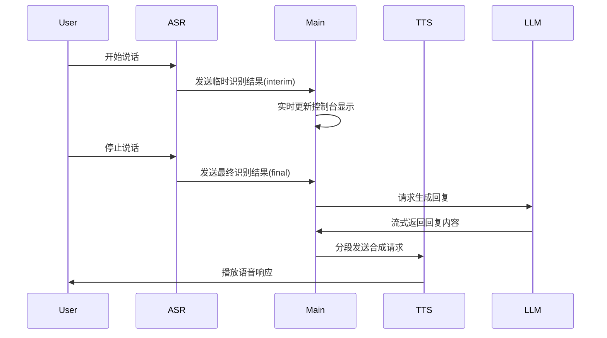

# Project

`LLM_api.py` 里面用了deepseek的api，基本上就是改里面的`prompt`参数，deepseek就会根据里面的prompt生成不同的东西，基本上`LLM_api.py`是一个还算是完整的东西

`streaming_tts.py` 就是一个用来实现`Text-to-Speech`的东西，但还没实现streaming的功能，他可以正常地生成`audio.mp3`而且里面的内容听起来是没有问题的，但就是没有实现streaming的功能，老师提供了一部分streaming的伪代码，都放在 `pesudo_tts_code.py`里，请根据 `streaming_tts.py` 以及 `pesudo_tts_code.py`的内容，帮我改写`streaming_tts.py`的内容，从而达到Sreaming的效果

`whisper_asr.py` 里面用了一个 Google Cloud的 Speech To Text API, 暂时来说是可以透过麦克风识别语音然后转换成文字的，但就是不知道streaming的效果行不行，不过我看到他能在我一边说话，一边整合出我说话的内容，看上去应该是没问题的

所以请根据`whisper_asr.py` 、`streaming_tts.py` 以及`LLM_api.py` 的内容，帮我用一个`main.py` 分別調用他們，做成一个真正的voice assistant

請幫我把 ` whisper_asr.py` 、`streaming_tts.py` 、`LLM_api.py` 以及 `main.py` 分開三個文檔，在每一個文檔中都幫我加一段像下面那樣的代碼，去讓我單獨地測試 `streaming_tts.py` 這三個文檔

> `````
> def main():
>     測試代碼
> 
> if __name__ == "__main__":
>     main()
> `````

Text To Speech的streaming流程：

>```
>LLM generates text sentence-by-sentence --> Stream each sentence to TTS --> TTS generates audio chunk --> Play audio chunk  
>```

Speech To Text的streaming流程（已經完成）：

> ```
> User starts speaking
>     |
>     v
> Record audio chunk ----->Send chunk to server-->Server processes chunk-->Partial feedback
>     |                                                                                   |
>     v                                                                                   v
> Record next audio chunk->Send chunk to server-->Process next chunk --> Update partial feedback
>     |                                                                                   |
>     v                                                                                   v
> ... (Repeat in parallel) ...                                           Update partial feedback
>     |                                                                                   |
>     v                                                                                   v
> User finishes speaking--------------> Signal end of stream --------------> Final feedback
> ```

### 这是整個項目的大概流程圖



我希望达到的效果就是，当我运行`python main.py`的时候，透过`whisper_asr.py` 识别我说话的内容，在识别的同时在终端也同步输出识别的内容，当我说完话之后，把所有识别到的内容交给`LLM_api.py`处理，当`LLM_api.py`处理完内容，开始输出内容的时候，把输出内容用逗号句号省略号等符号分开一段段内容，然后把逐段内容交给`streaming_tts.py`处理，并且输出音频文件，命名方式可以是`temp_i`，`i` 为段的数字，当输出完所有的音频文件，那就终止程序。
